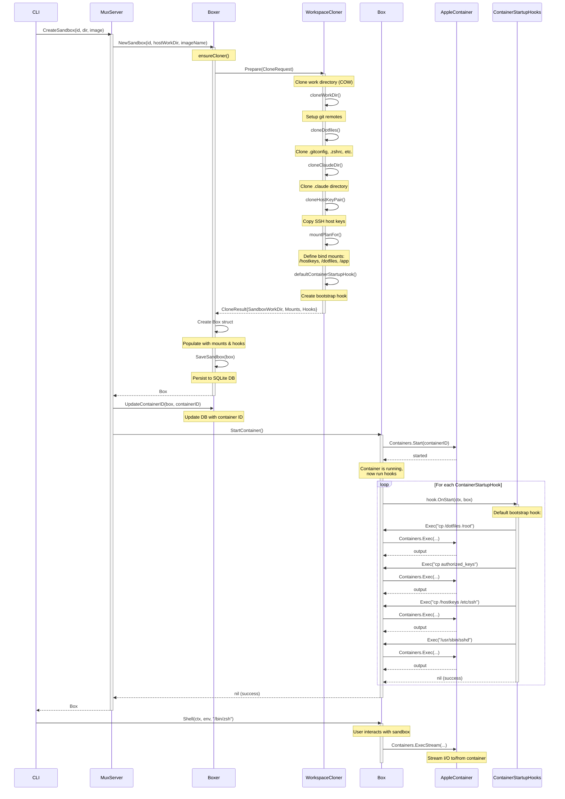

# `sand.Box` Lifecycle

This diagram illustrates the interaction flow when creating a new sandbox with `sand`.

## Key Components

### Boxer
- Central manager for sandbox lifecycle
- Maintains SQLite database of sandboxes
- Delegates workspace setup to `WorkspaceCloner`
- Persists sandbox metadata

### WorkspaceCloner
- Abstracts workspace preparation
- Default implementation clones directories using copy-on-write (COW)
- Sets up git remotes between host and sandbox
- Defines mount specifications for the container
- Creates `ContainerStartupHook` instances for post-start customization

### CloneResult
- Returned by `WorkspaceCloner.Prepare()`
- Contains:
  - `SandboxWorkDir`: Host path to cloned workspace
  - `Mounts`: List of bind mount specifications
  - `ContainerStartupHooks`: Bootstrap logic to run after container starts

### Box
- Represents a single sandbox instance
- Wraps Apple Container operations
- Executes hooks after container starts
- Provides `Shell()` and `Exec()` methods for user interaction

### ContainerStartupHooks
- Run after container starts but before user interaction
- Default hook copies dotfiles, SSH keys, and starts sshd
- Custom hooks can be injected via `WorkspaceCloner`

## Flow Summary

1. **Cloneing Phase**: `Boxer` calls `WorkspaceCloner.Prepare()` to clone workspace and define mounts/hooks
2. **Creation Phase**: `Box` creates container with specified mounts
3. **Bootstrap Phase**: `Box.StartContainer()` runs all `ContainerStartupHooks` to configure the running container
4. **Interactive Phase**: User attaches to container via `Box.Shell()`
